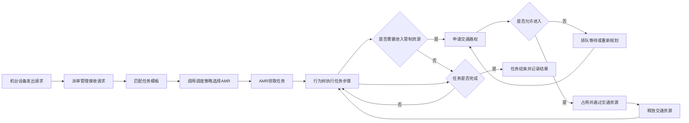
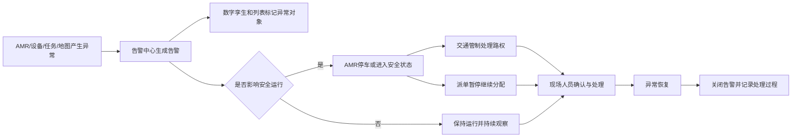

# AMR系统设计文档

## 1. 文档说明

### 1.1 文档目的

本文档用于说明 FXXXXXN AMR CONTROL 平台当前阶段的产品定位、主要功能、页面架构、核心业务流程以及各模块之间的关系，为产品原型、前端页面设计和研发需求沟通提供统一依据。

本文档聚焦业务功能与前端交互，不讨论通信协议、调度算法实现、SLAM算法、路径规划算法及后端技术架构。

### 1.2 当前阶段范围

- 首期接入单一品牌AMR，同时为未来跨品牌接入保留扩展空间。
- 平台可以直接调度单台AMR。
- 使用场景为厂内流水线物流，包括送料、取料、转运、空箱回收和充电等任务。
- 当前以简单场景和UI原型为主，不要求一次实现所有高级能力。
- 地图、AMR、机台设备和任务均归属于具体专案。
- 楼层和地图作为平台主要的全局运行范围。

## 2. 产品定位

FXXXXXN AMR CONTROL 是面向厂内物流场景的AMR管理与调度平台。平台围绕地图、AMR、机台设备和任务建立统一业务模型，对设备请求进行派单，通过行为树执行任务，并在执行过程中持续进行交通管制和运行监控。

平台主要服务以下角色：

| 角色 | 主要目标 |
| --- | --- |
| 调度与现场人员 | 查看AMR、任务、设备和告警状态，处理运行异常 |
| 地图与实施人员 | 创建地图，编辑道路、点位、设备映射和交通资源 |
| 研发人员 | 配置调度策略、行为树并使用API测试工具进行联调 |
| 系统管理员 | 管理用户、角色、配置、数据字典和系统日志 |

## 3. 核心业务对象

| 业务对象 | 说明 |
| --- | --- |
| 专案 | 一套相对独立的厂内物流业务配置集合 |
| 楼层 | 专案中的物理楼层，用于组织地图 |
| 地图 | AMR运行、任务执行、设备映射和交通管制的空间基础 |
| AMR | 执行厂内物流任务的移动机器人 |
| 设备 | CNC、上下料站、自动门、电梯、充电桩等现场设备 |
| 请求 | 机台设备或外部系统发出的物流需求 |
| 任务 | 平台根据请求生成的可调度执行单元 |
| 调度策略 | 决定任务应分配给哪台AMR的策略 |
| 行为树 | 定义AMR领取任务后按照什么步骤执行 |
| 交通资源 | 路口、窄通道、会车区、电梯、自动门等需要控制进入权的资源 |
| 告警 | AMR、设备、任务、地图或平台运行过程中产生的异常事件 |

## 4. 整体业务流程

### 4.1 专案初始化流程

平台投入运行前，需要完成以下基础配置：

1. 创建专案。
2. 创建楼层和地图记录。
3. 通过空白创建、文件导入或AMR扫描生成基础地图。
4. 编辑导航道路、站点、设备映射、交通资源和安全区域。
5. 校验并发布地图版本。
6. 添加AMR并配置对应型号。
7. 添加CNC等机台设备并绑定地图点位。
8. 配置调度策略。
9. 创建并发布行为树。
10. 完成API联调和基础运行测试。

### 4.2 任务执行主流程



### 4.3 模块职责边界

- 派单管理决定“任务分配给哪台AMR”。
- 行为树决定“AMR领取任务后按照哪些步骤执行”。
- 交通管制决定“AMR何时可以进入某个道路、区域或交通设备”。
- 地图管理定义“AMR在哪里运行以及业务对象位于哪里”。
- 实时监控负责“当前运行状态是什么”。
- 告警中心负责“异常如何集中展示、确认和处理”。

## 5. 信息架构与页面层级

平台采用顶部一级导航、左侧二级导航和业务详情三级页面的结构。

| 一级模块 | 二级页面 | 三级页面或主要下钻 |
| --- | --- | --- |
| 首页 | 运行总览 | AMR、任务、地图及异常对象详情 |
| 派单管理 | 任务列表、创建任务、调度策略、调度记录 | 任务详情 |
| 交通管制 | 交通态势、管制资源、管制记录 | 资源详情、记录详情 |
| 行为树管理 | 行为树列表、行为树编辑器 | 版本详情 |
| 地图管理 | 地图编辑器、地图管理 | 地图版本详情、扫描建图流程 |
| AMR管理 | AMR列表、型号配置 | AMR详情 |
| 设备管理 | 设备列表、设备类型 | 设备详情 |
| API测试 | 接口目录、测试工作台、请求历史 | 请求详情 |
| 平台设置 | 用户管理、角色权限、配置管理、数据字典、操作日志、系统日志 | 对象详情 |

AMR详情和设备详情不是独立的二级菜单。用户需要从对应列表选择指定对象进入详情页，并通过“返回列表”回到父级页面。

## 6. 全局运行范围

平台顶部提供全局运行范围选择器，当前原型采用：

```text
楼层 / 地图
```

未来可扩展为：

```text
专案 / 厂区 / 楼栋 / 楼层 / 地图
```

全局范围影响以下页面：

- 运行概览和数字孪生显示的现场范围。
- 交通态势、交通资源和交通记录。
- 派单任务的默认筛选范围。
- 地图编辑器当前打开的地图。
- AMR和设备列表的默认筛选范围。
- 告警中心的默认告警范围。

当地图编辑器存在未保存修改时，切换全局地图应提示用户保存草稿、放弃修改或取消切换。

## 7. 主要功能设计

### 7.1 首页

首页不再拆分二级页面，并单独隐藏二级侧边栏。当前原型阶段仅用于展示数字孪生能力的文字示意，不呈现临时的2D地图、运行指标或快捷操作。

主要内容：

- 显示数字孪生功能定位与建设范围。
- 显示顶部全局选择的楼层和地图。
- 说明未来将呈现AMR实时位置、机台设备状态、任务执行路径、交通资源占用和运行异常定位。

数字孪生能力成熟后，再以真实孪生视图替换当前文字示意。

### 7.2 交通管制

#### 7.2.1 交通态势

通过地图实时展示：

- AMR当前位置和计划路线。
- 当前占用和已授权的交通资源。
- 等待路权的AMR及队列。
- 临时封锁区域。
- 交通冲突和预计释放时间。
- 自动门、电梯等交通设备状态。

支持查看资源路权流转，以及在异常情况下临时封锁路段或释放异常占用。

#### 7.2.2 管制资源

管理路口、窄通道、会车区、缓冲区、自动门和电梯等交通资源。

主要配置包括：

- 所属地图和空间范围。
- 资源类型和容量。
- 通行方向。
- 放行规则。
- 当前占用AMR和等待队列。
- 启用、停用和临时封锁状态。

#### 7.2.3 管制记录

记录路权申请、授予、等待、进入、释放、冲突消解、重新规划和人工干预事件，支持按资源、AMR、任务、事件和结果查询。

### 7.3 派单管理

#### 7.3.1 任务列表

展示任务编号、类型、起点、终点、执行AMR、优先级、状态和创建时间。

任务主要状态建议为：

```text
待调度 → 已分配 → 执行中 → 等待 → 已完成
                         ↘ 异常 / 已取消
```

#### 7.3.2 创建任务

用于研发或现场人员手动创建任务，主要填写任务类型、起点、终点、优先级、调度方式和行为树等信息。

#### 7.3.3 调度策略

配置研发提供的调度策略及其可见参数。调度策略负责根据任务和候选AMR选择执行车辆，不负责具体交通路权。

#### 7.3.4 调度记录

记录每次任务分配使用的策略、候选车辆、最终选择结果、计算耗时和失败原因。

### 7.4 地图管理

#### 7.4.1 地图编辑器

地图编辑器是地图模块默认首页，直接打开全局运行范围中当前选中的地图。

编辑器必须明确区分：

- 运行版本：正在被任务、交通管制和AMR使用的只读版本。
- 编辑版本：基于运行版本创建的可修改草稿。

地图采用分层结构：

```text
地图
├─ 基础地图层
│  └─ AMR扫描或文件导入的栅格地图
├─ 导航拓扑层
│  ├─ 道路与方向
│  ├─ 节点
│  └─ 站点与停靠方向
├─ 业务对象层
│  ├─ CNC机台
│  ├─ 上下料点
│  ├─ 缓存区
│  └─ 充电站
├─ 交通管制层
│  ├─ 路权区
│  ├─ 窄通道
│  ├─ 交叉路口
│  └─ 门禁与电梯
└─ 安全校验层
   ├─ 地图比对区域
   ├─ 禁行区域
   └─ 限速区域
```

地图状态建议为：

```text
空白 → 草稿 → 待校验 → 校验通过 → 已发布 → 已归档
```

编辑中的地图不能直接影响在线AMR。地图必须校验并发布后，才能成为新的运行版本。

#### 7.4.2 地图管理

地图管理页面只负责地图实体及生命周期，不直接编辑道路和点位。

主要功能：

- 创建空白地图记录。
- 查看地图编号、名称、楼层、来源和状态。
- 查看运行版本和编辑版本。
- 设置当前地图并进入编辑器。
- 复制、停用、归档和查看历史版本。
- 创建从未发布且没有业务关联的空地图。

#### 7.4.3 AMR扫描建图

地图可以通过AMR激光雷达扫描生成基础栅格图。

前端流程为：

1. 选择在线且可用的AMR。
2. 选择目标楼层和地图。
3. 选择创建新地图或创建当前地图的新版本。
4. 启动现场扫描。
5. 展示扫描进度和点阵生成状态。
6. 预览、裁剪和确认扫描结果。
7. 保存为地图草稿。
8. 补充道路、点位、设备和交通资源。
9. 校验并发布地图。

AMR扫描结果只生成基础地图草稿，不允许直接覆盖运行版本。

#### 7.4.4 运行时地图相似度检测

AMR运行时持续扫描现场，并将现场扫描结果与当前发布地图进行比对。

当相似度偏差超过研发设定的阈值并持续一定时间时：

1. 生成地图偏差告警。
2. 异常AMR停止运行或进入安全状态。
3. 派单管理暂停向该AMR分配新任务。
4. 交通管制冻结或释放相关路权。
5. 数字孪生标记异常AMR和偏差区域。
6. 告警中心通知现场人员处理。

地图编辑器负责配置比对区域和阈值展示，实时告警处理归属于告警中心。

### 7.5 AMR管理

#### 7.5.1 AMR列表

展示AMR编号、型号、连接状态、运行状态、电量、当前位置、当前任务和更新时间。

用户点击指定AMR进入三级详情页。

#### 7.5.2 AMR详情

详情页主要展示：

- 连接状态和通信延迟。
- 当前电量、速度和坐标。
- 当前任务及执行步骤。
- 实时地图位置。
- 今日任务和运行时长。
- 最近事件和异常。
- 地图匹配度及定位质量，后续扩展。

详情页提供返回AMR列表、地图定位和创建指定任务等操作。

#### 7.5.3 型号配置

维护AMR型号、载重、速度、尺寸、电量阈值和展示参数，为未来多型号和跨品牌接入预留统一配置入口。

### 7.6 设备管理

#### 7.6.1 设备列表

展示设备编号、类型、所属区域、运行状态、连接状态、地图和绑定点位。用户点击指定设备进入三级详情页。

#### 7.6.2 设备详情

展示设备实时状态、连接延迟、所属区域、地图位置、上下料点位和关联任务，并提供返回设备列表、地图定位和编辑映射操作。

#### 7.6.3 设备类型

配置CNC、通用机台、充电桩、自动门和电梯等设备类型的图标、状态字典、默认属性和点位要求。

### 7.7 行为树管理

行为树定义任务的具体执行过程。典型节点包括：

- 前往指定站点。
- 申请交通资源。
- 等待设备就绪。
- 执行取料或放料。
- 等待机台反馈。
- 释放交通资源。
- 异常重试或结束任务。

行为树列表负责版本和状态管理；行为树编辑器负责节点、连线和属性配置。行为树发布后供任务执行使用，编辑草稿不能直接影响正在执行的任务。

### 7.8 API测试

面向研发联调，提供：

- 接口目录和业务分类。
- 请求方法、地址、参数和请求体编辑。
- 响应状态、耗时、响应体和错误信息展示。
- 请求历史和测试用例复用。

API测试是研发工具，不承担正式业务操作审计职责。

### 7.9 平台设置

#### 用户管理

管理用户账号、状态和角色。

#### 角色权限

配置模块查看、编辑和高风险操作权限。发布地图、释放路权、临时封锁和删除业务对象等操作应单独授权。

#### 配置管理

维护前端可见的平台参数和环境配置。

#### 数据字典

统一维护AMR、任务、设备、告警和交通资源的状态显示。

#### 操作日志

记录用户在平台中的关键操作，包括地图发布、任务创建、人工封锁和配置修改。

#### 系统日志

按服务、模块、对象和Trace ID查询系统运行信息，主要供研发定位问题。

## 8. 告警联动流程



告警建议至少区分提示、警告和严重三个级别。是否停车、是否暂停派单以及是否冻结交通资源，由异常类型和研发配置共同决定。

## 9. 关键状态建议

### 9.1 AMR状态

- 离线
- 空闲
- 执行中
- 等待
- 充电中
- 暂停
- 故障
- 安全停车

### 9.2 设备状态

- 离线
- 空闲
- 加工中
- 请求上料
- 请求下料
- 等待AMR
- 故障

### 9.3 交通资源状态

- 空闲
- 已申请
- 已授权
- 已占用
- 等待释放
- 临时封锁
- 异常占用

### 9.4 告警状态

- 未确认
- 已确认
- 处理中
- 已恢复
- 已关闭

## 10. 当前原型不包含的内容

- AMR通信协议和跨品牌协议适配实现。
- SLAM、地图匹配和路径规划算法实现。
- 调度策略和交通管制算法实现。
- 后端接口、数据库和消息队列设计。
- 生产环境权限、审计和数据安全的完整实现。
- 多厂区、多楼栋和跨楼层调度的完整业务实现。
- 真实设备控制和安全认证。

## 11. 后续扩展方向

- 多品牌AMR统一接入和能力模型。
- 多专案、多厂区、多楼栋和多楼层管理。
- 电梯、自动门、交通灯等复杂交通设备联动。
- 扫描地图与运行地图差异可视化。
- 地图版本对比、灰度发布和安全回滚。
- 任务模板与设备请求规则管理。
- 行为树版本回溯和运行实例追踪。
- 运行报表、效率分析和设备健康度分析。
- 仿真测试环境及场景回放。

## 12. 产品设计原则

1. 全局范围一致：地图相关页面共享同一楼层和地图上下文。
2. 运行与编辑隔离：地图、行为树和策略草稿不能直接影响在线任务。
3. 列表到详情下钻：具体AMR和设备详情不占用二级导航。
4. 业务职责清晰：派单、行为树、交通管制和地图管理各自解决不同问题。
5. 高风险操作可追溯：发布、封锁、释放、删除和配置修改必须记录。
6. 简单场景优先：首期满足单品牌、单车调度和厂内流水线物流，同时保留扩展位置。
